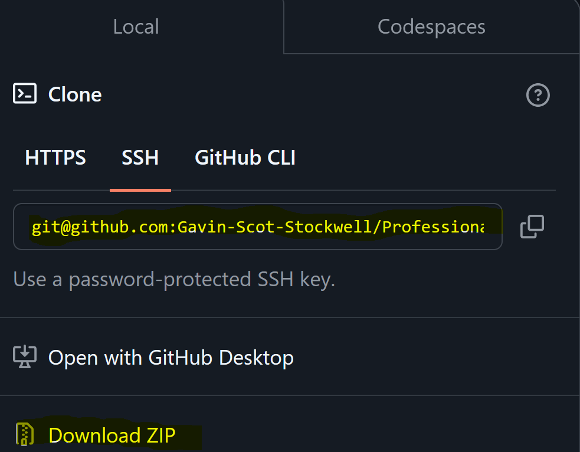

# Professional README Generator

## License

# Table Of Contents
* [Description](#description)
* [Installation](#installation)
* [Usage](#usage)
* [License](#license)
* [Contributing](#contributing)
* [Tests](#tests)
* [Questions](#questions)

## Description
The Professional README Generator, as stated, is a generator for README files. It allows users to create a README file and fill in information about their app in a quick and easy way.

## Installation
How to download
* First go to the github link provided below and click.

* Next click the Code button
* Following that you have two choices
* Either download as a clone in your console with the git command “clone …” with the SSH by copying the link and entering the command OR download directly with the zip file and unzip the file

## Usage
Use Professional README Generator for professional uses, private pet projects, or to mess around with.

## Contributing

Gavin Scot Stockwell -js

## Tests
* Open file “index.js” in vscode
* Open terminal via right clicking index.js and click on “Open in Interaged Terminal”
* Follow given instructions from the terminal
* Once filled out the terminal will output in the Develop folder your named README.md file
* [video how to work app](https://youtu.be/ZniXqRTkx50)

## Questions
* GitHub-username https://github.com/Gavin-Scot-Stockwell
* Email-address gsstockwell@gmail.com

